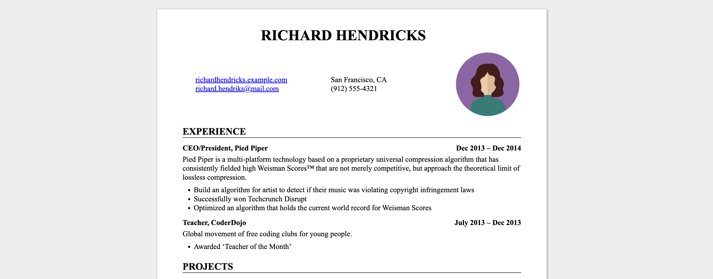

# resume.md

Write your english resume in
[Markdown](https://github.com/luca1iu/resume.md/blob/main/resume_english.md) and your german resume
in [Markdown](https://github.com/luca1iu/resume.md/blob/main/resume_german.md)
style it with [CSS](https://github.com/luca1iu/resume.md/blob/main/resume_english.css)
and [CSS](https://github.com/luca1iu/resume.md/blob/main/resume_german.css), output
to [HTML](https://github.com/luca1iu/resume.md/blob/main/resume_english.html)/[HTML](https://github.com/luca1iu/resume.md/blob/main/resume_german.html)
and
[PDF](https://github.com/luca1iu/resume.md/blob/main/resume_english.pdf)/[PDF](https://github.com/luca1iu/resume.md/blob/main/resume_english.pdf).

## New Feature

### 1. Add your avatar image to resume

Now, with the latest feature, you can also include an avatar image in your resume!

1. Place the `avatar.png` with your avatar or change `avatar_path` to your avatar path in
   `resume_with_avatar_english.py` or `resume_with_avatar_german.py`.
2. run `resume_with_avatar_english.py` or `resume_with_avatar_german.py`.

### 2. generate CV in English and German Version

if you want to have a english version of CV, you can edit `resume_english.md` and run `resume_with_avatar_english.py` to
generate the CV in English version.

if you want to have a German version of CV, you can edit `resume_german.md` and run `resume_with_avatar_german.py` to
generate the CV in German version.

## Prerequisites

- Python ≥ 3.6
- [python-markdown](https://python-markdown.github.io/) (`pip install markdown`)
- Optional, required for PDF output: Google Chrome or Chromium

## Usage

### Generate English Version of CV
1. Download [resume_english.py](resume_english.py) and
   [resume_english.css](resume_english.css) and [resume_with_avatar_english.py](resume_with_avatar_english.py) (or make a copy of this repository, forking, or
   cloning).
2. Edit [resume_english.md](resume_english.md) (the placeholder text is taken
   with thanks from
   the [JSON Resume Project](https://jsonresume.org/themes/))
3. Run `python3 resume_with_avatar_english.py` to build resume_english.html and resume_english.pdf.

### Generate German Version of CV
1. Download [resume_german.py](resume_german.py) and
   [resume_german.css](resume_german.css) and [resume_with_avatar_german.py](resume_with_avatar_german.py)(or make a copy of this repository, forking, or cloning).
2. Edit [resume_german.md](resume_german.md)
3. Run `python3 resume_with_avatar_german.py` to build resume_german.html and resume_german.pdf.

Notes:
    * Use `--no-html` or `--no-pdf` to disable HTML or PDF output.
    * Use `--chrome-path=/path/to/chrome` if resume.py cannot find your Chrome
      or Chromium executable.

## Customization

Edit [resume_english.css](resume_english.css) to change the appearance of your english resume. and
edit [resume_german.css](resume_german.css) to change the appearance of your German resume. The
default style is extremely generic, which is perhaps what you want in a resume,
but CSS gives you a lot of flexibility. See, e.g. [The Tech Resume
Inside-Out](https://www.thetechinterview.com/) for good advice about what a
resume should look like (and what it should say).

Change the appearance of the PDF version (without affecting the HTML version) by
adding rules under the `@media print` CSS selector.

Change the margins and paper size of the PDF version by editing the [`@page` CSS
rule](https://developer.mozilla.org/en-US/docs/Web/CSS/%40page/size).

